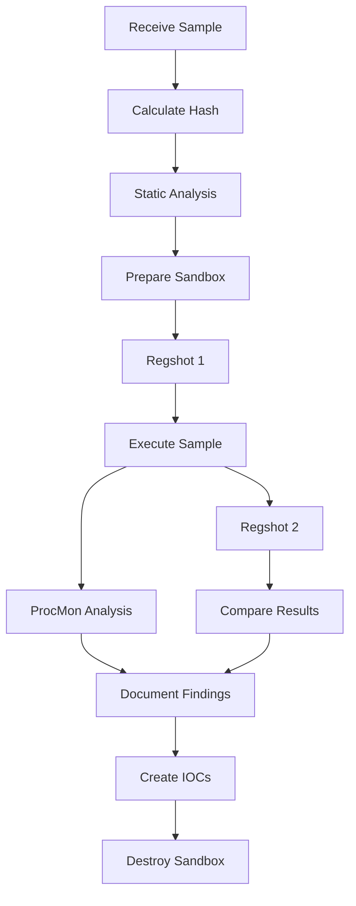

# 🎄 Advent of Cyber 2025 - Day 6: Malware Analysis - Egg-xecutable

[](https://tryhackme.com)
[](https://tryhackme.com)
[](https://tryhackme.com)
[](https://tryhackme.com)

## 📖 Overview

Day 6 introduces malware analysis fundamentals through hands-on investigation of a suspicious executable. Learn to safely analyze malware using industry-standard tools within a sandboxed environment.

### 🎯 Learning Objectives

- Understand principles of malware analysis (static vs. dynamic)
- Master sandbox environments for safe execution
- Use professional analysis tools (PeStudio, ProcMon, Regshot)
- Extract threat intelligence from malicious files
- Identify persistence mechanisms and C2 communication

## 🔍 Investigation Summary

**Threat Vector:** Phishing email with malicious attachment  
**Sample Name:** HopHelper.exe  
**Threat Actor:** Unknown (social engineering)  
**Attack Time:** 3 AM (suspicious timing)  
**Target:** TBFC employees  

## ⚠️ The Golden Rule

**NEVER run dangerous applications on devices you care about.**

Always use sandboxes—safe, isolated environments for malware execution.

## 🧪 Lab Setup

**Connection Details:**
- IP: `10.64.180.215`
- Username: `ElfMcBlue`
- Password: `TryH@cKMe1!`
- Sample Location: `Desktop/HopHelper/HopHelper.exe`

**⚠️ DO NOT execute HopHelper.exe until instructed!**

## 📚 Analysis Fundamentals

### Static vs. Dynamic Analysis

| Type | Description | Risk Level | Use Case |
|------|-------------|-----------|----------|
| **Static** | Examine without execution | Low | Initial triage, quick intel |
| **Dynamic** | Execute in sandbox | Medium | Behavior analysis, C2 discovery |

### Why Sandboxes?

**Virtual Machine Benefits:**
- ✅ Complete isolation from host
- ✅ Snapshot/restore capabilities
- ✅ Controlled environment
- ✅ Disposable and reproducible

## 📝 Static Analysis Walkthrough

### Tool: PeStudio

Professional static analysis tool for Windows executables.

### Step 1: Hash Extraction 🔐

**Purpose:** Create unique file identifier for threat intelligence.

**Procedure:**
1. Launch PeStudio (Desktop shortcut)
2. Drag & drop `HopHelper.exe`
3. Navigate to **file > sha256**

**Threat Intelligence Value:**
- Search on VirusTotal
- Share with TI platforms
- Create detection rules
- Track across environments

**🚩 SHA256**: `F29C270068F865EF4A747E2683BFA07667BF64E768B38FBB9A2750A3D879CA33`

### Step 2: String Analysis 📄

**Purpose:** Discover embedded text revealing malware behavior.

**Procedure:**
1. Click **"strings"** in left pane
2. Wait for calculation (several minutes)
3. Review output for IOCs

**What to Find:**
- IP addresses (C2 servers)
- URLs (malicious domains)
- File paths (persistence locations)
- Commands (actions to execute)
- Flags (hidden messages)

**🚩 Flag**: `THM{STRINGS_FOUND}` (towards bottom of strings)

### Static Analysis IOCs

```
SHA256: F29C270068F865EF4A747E2683BFA07667BF64E768B38FBB9A2750A3D879CA33
Flag: THM{STRINGS_FOUND}
Type: Windows PE Executable
Suspicious Strings: [Various indicators found]
```

## 🔬 Dynamic Analysis Walkthrough

### Tool 1: Regshot - Registry Monitoring

**Purpose:** Detect registry changes for persistence identification.

#### Why Registry Matters

Malware achieves **persistence** through registry Run keys:
```
HKEY_CURRENT_USER\...\Run
HKEY_LOCAL_MACHINE\...\Run
```

#### Procedure

**Step 1: Baseline Snapshot**
1. Launch Regshot (Desktop shortcut)
2. Set output path to Desktop
3. Click **1st shot** → **Shot**
4. Wait for completion

**Step 2: Execute Malware**
```bash
# ⚠️ NOW you may execute HopHelper.exe
Navigate to: Desktop/HopHelper/
Run: HopHelper.exe
```

**Step 3: Post-Execution Snapshot**
1. Return to Regshot
2. Click **2nd shot** → **Shot**
3. Wait for completion

**Step 4: Compare Results**
1. Click **Compare**
2. Text editor opens with diff
3. Search for "HopHelper"

#### Findings

**🚩 Registry Key Modified**: 
```
HKU\S-1-5-21-1966530601-3185510712-10604624-1008\Software\Microsoft\Windows\CurrentVersion\Run\HopHelper
```

**Analysis:** Persistence mechanism confirmed. Malware runs on user login.

### Tool 2: ProcMon - Process Monitoring

**Purpose:** Real-time monitoring of process interactions.

#### What ProcMon Captures

- **Registry Operations**: RegOpenKey, RegSetValue
- **File Operations**: CreateFile, WriteFile
- **Network Operations**: TCP Connect, TCP Send/Receive
- **Process Operations**: Process Start/Exit

#### Procedure

**Step 1: Start Capture**
1. Launch Process Monitor (Desktop shortcut)
2. Automatic capture begins
3. Execute `HopHelper.exe` again
4. Wait 1 minute for full execution

**Step 2: Stop Capture**
1. Click **Play** button (stops capture)
2. Events frozen for analysis

**Step 3: Apply Process Filter**
```
Filter: Process Name | is | HopHelper.exe
Action: Add → OK
```

**Step 4: Apply Operation Filter**
```
Filter: Operation | contains | TCP
Action: Add → OK
```

#### Network Analysis

**Key Operations:**
- `TCP Connect` - Establishing connections
- `TCP Send` - Data exfiltration
- `TCP Receive` - Command reception

**🚩 Protocol**: `http`

**Finding:** HopHelper.exe uses HTTP for C2 communication.

#### Filter Management

**Remove Filters:**
- Select filter → Click "Remove"

**Reset All Filters:**
- Filter → Reset Filter

## 🏆 Challenge Answers

| Question | Answer |
|----------|--------|
| SHA256Sum of HopHelper.exe | `F29C270068F865EF4A747E2683BFA07667BF64E768B38FBB9A2750A3D879CA33` |
| Flag in strings | `THM{STRINGS_FOUND}` |
| Registry persistence key | `HKU\S-1-5-21-1966530601-3185510712-10604624-1008\Software\Microsoft\Windows\CurrentVersion\Run\HopHelper` |
| Network protocol | `http` |

## 🛡️ Defensive Actions

### Immediate Response

**Containment:**
```bash
# Isolate affected systems
# Block C2 infrastructure at firewall
# Disable compromised accounts
```

**Eradication:**
```bash
# Remove registry Run key
reg delete "HKCU\Software\Microsoft\Windows\CurrentVersion\Run" /v HopHelper /f

# Delete malware
del HopHelper.exe

# Scan for additional persistence
```

**Recovery:**
```bash
# Restore from clean backup
# Reset user passwords
# Verify system integrity
```

### Detection Rules

**YARA Rule:**
```yara
rule HopHelper_Malware {
    meta:
        description = "Detects HopHelper malware"
        author = "TBFC SOC"
        date = "2025-12-06"
    
    condition:
        hash.sha256(0, filesize) == 
        "F29C270068F865EF4A747E2683BFA07667BF64E768B38FBB9A2750A3D879CA33"
}
```

**Sigma Rule (Registry Detection):**
```yaml
title: HopHelper Persistence Detection
detection:
    selection:
        EventID: 13
        TargetObject|contains: '\Run\HopHelper'
    condition: selection
```

**Network Detection:**
```
Alert: HTTP connections from suspicious processes
Block: C2 IP/domain identified in analysis
Monitor: Outbound port 80 from non-browser processes
```

## 🔧 Tools Reference

### PeStudio
**Purpose:** Static analysis  
**Key Features:**
- Hash calculation (MD5, SHA1, SHA256)
- String extraction
- Import/export analysis
- Resource examination

**Best For:** Initial triage, IOC extraction

### Regshot
**Purpose:** Registry change detection  
**Key Features:**
- Before/after snapshots
- Differential comparison
- Text-based output

**Best For:** Persistence mechanism identification

### Process Monitor (ProcMon)
**Purpose:** Real-time monitoring  
**Key Features:**
- Registry operations
- File system activity
- Network connections
- Process creation

**Best For:** Detailed behavior analysis

## 📊 Analysis Workflow



## 📋 Malware Analysis Checklist

**Pre-Execution:**
- [ ] Calculate file hash (SHA256)
- [ ] Static analysis (strings, imports)
- [ ] Prepare sandbox environment
- [ ] Take registry snapshot

**During Execution:**
- [ ] Monitor with ProcMon
- [ ] Observe network activity
- [ ] Note immediate system changes

**Post-Execution:**
- [ ] Take second registry snapshot
- [ ] Compare registry changes
- [ ] Analyze ProcMon logs
- [ ] Document all findings

**Documentation:**
- [ ] Create IOC list
- [ ] Write analysis report
- [ ] Generate detection rules
- [ ] Share threat intelligence

## 💡 Key Insights

### Static Analysis Revealed

✅ Unique file fingerprint (SHA256)  
✅ Embedded strings and flags  
✅ Suspicious indicators present  
✅ Initial threat intelligence gathered  

### Dynamic Analysis Revealed

✅ Registry persistence mechanism  
✅ HTTP C2 communication  
✅ Complete behavior profile  
✅ Actionable defensive measures  

## 🎓 Best Practices

### The Golden Rules

1. **Always use sandboxes** - Never on production
2. **Document everything** - Screenshots, hashes, timestamps
3. **Network isolation** - Prevent spreading
4. **Snapshot management** - Save clean states
5. **Share intelligence** - Help the community

### Common Mistakes to Avoid

❌ Running malware on personal/work devices  
❌ Skipping static analysis  
❌ Not documenting findings  
❌ Forgetting to snapshot before execution  
❌ Analyzing without network isolation  

## 🔗 Related Resources

### TryHackMe Rooms
- [Basic Static Analysis](https://tryhackme.com) - Deep dive into static techniques
- [Basic Dynamic Analysis](https://tryhackme.com) - Advanced dynamic methods
- [Malware Analysis Fundamentals](https://tryhackme.com) - Comprehensive course

### External Resources
- [SANS Malware Analysis Cheat Sheet](https://www.sans.org/)
- [Flare VM](https://github.com/mandiant/flare-vm) - Malware analysis distribution
- [Remnux](https://remnux.org/) - Linux malware analysis toolkit
- [Malware Bazaar](https://bazaar.abuse.ch/) - Malware sample repository

### Tools Download
- [PeStudio](https://www.winitor.com/) - Static analysis
- [Sysinternals Suite](https://docs.microsoft.com/en-us/sysinternals/) - ProcMon and more
- [Regshot](https://sourceforge.net/projects/regshot/) - Registry monitoring

## 📈 Threat Intelligence

### IOCs Extracted

**File Indicators:**
```
SHA256: F29C270068F865EF4A747E2683BFA07667BF64E768B38FBB9A2750A3D879CA33
Filename: HopHelper.exe
Size: [varies]
Type: Windows PE32 executable
```

**Registry Indicators:**
```
Key: HKCU\Software\Microsoft\Windows\CurrentVersion\Run\HopHelper
Type: Persistence mechanism
Action: Creates value for autostart
```

**Network Indicators:**
```
Protocol: HTTP
Port: 80 (likely)
Activity: C2 communication
```

## 🤝 Contributing

Improvements to analysis techniques? Open a PR!

## 📜 License

Educational purposes only. All credit to TryHackMe and Advent of Cyber 2025.

---

⭐ **Found this helpful? Star the repo!**

🔬 **Day 6/25 Complete - Analyze safely, defend confidently!**

[](https://github.com/CYB3RLEO)
