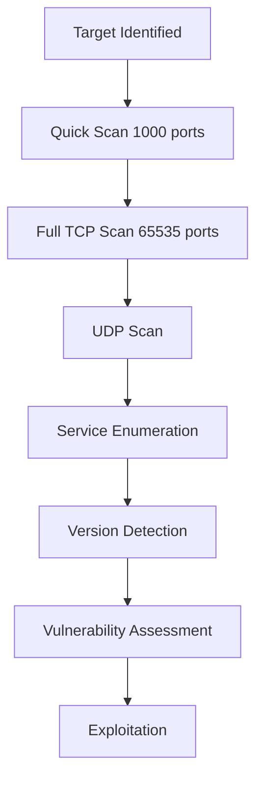

# 🎄 Advent of Cyber 2025 - Day 7: Network Discovery - Scan-ta Clause

[](https://tryhackme.com)
[](https://tryhackme.com)
[](https://tryhackme.com)
[](https://nmap.org)

## 📖 Overview

Day 7 introduces network discovery and port scanning fundamentals. HopSec has locked TBFC out of their QA server—it's time to scan, enumerate, and regain access through systematic network reconnaissance.

### 🎯 Learning Objectives

- Master Nmap for network service discovery
- Understand TCP vs UDP protocols
- Enumerate services across different ports
- Apply reconnaissance skills to regain access
- Discover both external and internal services

## 🔍 Investigation Summary

**Threat Actor:** HopSec  
**Target System:** tbfc-devqa01 QA Server  
**Target IP:** `10.67.173.8`  
**Status:** Locked out, slowly converting to EAST-mas  
**Mission:** Scan, enumerate, regain access  

## 🗺️ Network Reconnaissance

### Attack Plan

```
1. Know your target → IP: 10.67.173.8
2. Scan for open ports → Find exposed services
3. Enumerate services → Discover keys and vulnerabilities
4. Exploit access → Regain control
5. Find 3 keys → Unlock admin panel
```

## 📝 Complete Walkthrough

### Phase 1: Basic TCP Scan 🔎

**Objective:** Identify open ports

```bash
nmap 10.67.173.8
```

**Results:**
```
PORT     STATE SERVICE
22/tcp   open  ssh
80/tcp   open  http
```

**Investigation:**
- Visit `http://10.67.173.8`
- Website defaced: **"Pwned by HopSec"** 🚩

**🚩 Answer 1:** `Pwned by HopSec`

### Phase 2: Comprehensive Port Scan 📡

**Limitation:** Basic scan only checks top 1000 ports out of 65,535!

**Enhanced Scan:**
```bash
nmap -p- --script=banner 10.67.173.8
```

**Flags:**
- `-p-` → Scan ALL 65,535 ports
- `--script=banner` → Grab service banners

**Results:**
```
PORT      STATE SERVICE
22/tcp    open  ssh
|_banner: SSH-2.0-OpenSSH_9.6p1 Ubuntu-3ubuntu13.14
80/tcp    open  http
21212/tcp open  trinket-agent
|_banner: 220 (vsFTPd 3.0.5)
25251/tcp open  unknown
|_banner: TBFC maintd v0.2
```

**Discoveries:**
- Port 21212: FTP (non-standard port)
- Port 25251: Custom TBFC application

### Phase 3: FTP Enumeration (Key 1) 📁

**Service:** FTP on port 21212

**Connect:**
```bash
ftp 10.67.173.8 21212
```

**Login:**
```
Name: anonymous
Password: [Enter]
```

**Enumerate:**
```bash
ftp> ls
-rw-r--r--  1  ftp  ftp  13 Oct 22 16:27 tbfc_qa_key1

ftp> get tbfc_qa_key1 -
3aster_

ftp> quit
```

**🚩 Answer 2:** `3aster_`

**Security Issue:** Anonymous FTP with no authentication

### Phase 4: Custom Service Enumeration (Key 2) 🔧

**Service:** TBFC maintd on port 25251

**Connect with Netcat:**
```bash
nc -v 10.67.173.8 25251
```

**Service Banner:**
```
TBFC maintd v0.2
Type HELP for commands.
```

**Enumerate Commands:**
```bash
HELP
Commands: HELP, STATUS, GET KEY, QUIT
```

**Retrieve Key:**
```bash
GET KEY
15_th3_
```

**🚩 Answer 3:** `15_th3_`

**Exit:** `CTRL+C`

**Security Issue:** Unauthenticated access to sensitive data

### Phase 5: UDP Scanning (Key 3) 🌐

**Protocol Shift:** Previous scans only covered TCP. Time for UDP!

**UDP Scan:**
```bash
nmap -sU 10.67.173.8
```

**Results:**
```
PORT   STATE SERVICE
53/udp open  domain
```

**DNS Enumeration:**
```bash
dig @10.67.173.8 TXT key3.tbfc.local +short
"n3w_xm45"
```

**Command Breakdown:**
- `dig` → DNS query tool
- `@10.67.173.8` → Query this DNS server
- `TXT` → Request TXT records
- `key3.tbfc.local` → Domain to query
- `+short` → Concise output

**🚩 Answer 4:** `n3w_xm45`

**Security Issue:** Sensitive data in DNS TXT records

### Phase 6: Admin Panel Access 🔓

**Combined Key:** `3aster_15_th3_n3w_xm45`

**Access:**
1. Visit `http://10.67.173.8`
2. Enter combined key
3. Access Secret Admin Console

### Phase 7: Internal Service Discovery 💻

**On-Host Port Enumeration:**
```bash
ss -tunlp
```

**Flags:**
- `-t` → TCP sockets
- `-u` → UDP sockets
- `-n` → Numeric (no DNS resolution)
- `-l` → Listening ports only
- `-p` → Show process

**Results:**
```
Local Address:Port    
0.0.0.0:53           # External: DNS
0.0.0.0:22           # External: SSH
0.0.0.0:80           # External: HTTP
0.0.0.0:21212        # External: FTP
0.0.0.0:25251        # External: TBFC app
127.0.0.1:3306       # LOCAL ONLY: MySQL
127.0.0.1:7681       # LOCAL ONLY: Unknown
127.0.0.1:8000       # LOCAL ONLY: Unknown
```

**Key Insight:**
- `0.0.0.0` = Accessible externally
- `127.0.0.1` = Localhost only (not scannable remotely)

**🚩 Answer 5:** `3306`

### Phase 8: Database Access 🗄️

**MySQL on Port 3306** (localhost binding = not remotely accessible)

**List Tables:**
```bash
mysql -D tbfcqa01 -e "show tables;"
```

**Output:**
```
+--------------------+
| Tables_in_tbfcqa01 |
+--------------------+
| flags              |
+--------------------+
```

**Query Flags:**
```bash
mysql -D tbfcqa01 -e "select * from flags;"
```

**🚩 Answer 6:** `THM{4ll_s3rvice5_d1sc0vered}`

## 🏆 Challenge Answers

| Question | Answer |
|----------|--------|
| Evil message on website | `Pwned by HopSec` |
| First key (FTP) | `3aster_` |
| Second key (TBFC app) | `15_th3_` |
| Third key (DNS) | `n3w_xm45` |
| MySQL port | `3306` |
| Final flag | `THM{4ll_s3rvice5_d1sc0vered}` |

## 🛠️ Tool Reference

### Nmap Command Guide

#### Basic Scans
```bash
# Quick scan (top 1000 ports)
nmap <target>

# All TCP ports
nmap -p- <target>

# Specific ports
nmap -p 22,80,443 <target>

# Port range
nmap -p 1-1000 <target>
```

#### Protocol Scans
```bash
# TCP SYN scan (default, requires root)
nmap -sS <target>

# TCP Connect scan (no root needed)
nmap -sT <target>

# UDP scan
nmap -sU <target>

# Both TCP and UDP
nmap -sS -sU <target>
```

#### Service Detection
```bash
# Version detection
nmap -sV <target>

# OS detection
nmap -O <target>

# Banner grabbing
nmap --script=banner <target>

# Aggressive scan (version, OS, scripts, traceroute)
nmap -A <target>
```

#### Speed Templates
```bash
# Paranoid (slowest, stealthy)
nmap -T0 <target>

# Sneaky
nmap -T1 <target>

# Polite (slower)
nmap -T2 <target>

# Normal (default)
nmap -T3 <target>

# Aggressive (faster)
nmap -T4 <target>

# Insane (fastest, noisy)
nmap -T5 <target>
```

#### Output Formats
```bash
# Normal output
nmap -oN scan.txt <target>

# XML output
nmap -oX scan.xml <target>

# Grepable output
nmap -oG scan.grep <target>

# All formats at once
nmap -oA scan <target>
```

### Additional Tools

#### Netcat (nc)
```bash
# Connect to TCP service
nc -v <IP> <PORT>

# Listen on port
nc -lvp <PORT>

# UDP mode
nc -u <IP> <PORT>
```

#### dig (DNS queries)
```bash
# Query A record
dig <domain>

# Query specific DNS server
dig @<DNS-SERVER> <domain>

# Query TXT records
dig @<DNS-SERVER> TXT <domain>

# Short output
dig +short <domain>
```

#### FTP Client
```bash
# Connect to FTP
ftp <IP> <PORT>

# Anonymous login
Username: anonymous
Password: [Enter]

# Common commands
ls              # List files
get <file>      # Download file
put <file>      # Upload file
quit            # Exit
```

#### MySQL Client
```bash
# Connect to database
mysql -h <HOST> -u <USER> -p

# Execute command without interactive mode
mysql -D <DATABASE> -e "<QUERY>"

# Common commands
show databases;
use <database>;
show tables;
select * from <table>;
```

#### ss (Socket Statistics)
```bash
# Show all listening ports
ss -tunlp

# TCP only
ss -tln

# UDP only
ss -uln

# With process info (requires root)
ss -tunlp
```

## 📊 Network Map

### External Services (0.0.0.0)

| Port | Protocol | Service | Status | Security |
|------|----------|---------|--------|----------|
| 22 | TCP | SSH | Open | Requires credentials |
| 80 | TCP | HTTP | Defaced | Entry point |
| 53 | UDP | DNS | Open | Info disclosure |
| 21212 | TCP | FTP | Anonymous | High risk |
| 25251 | TCP | TBFC maintd | No auth | High risk |

### Internal Services (127.0.0.1)

| Port | Service | Accessible From | Content |
|------|---------|-----------------|---------|
| 3306 | MySQL | Localhost only | Final flag |
| 7681 | Unknown | Localhost only | Not investigated |
| 8000 | Unknown | Localhost only | Not investigated |

## 🔐 Security Issues Identified

### Critical Vulnerabilities

**1. Anonymous FTP Access**
```
Severity: HIGH
Service: FTP on port 21212
Issue: No authentication required
Risk: Data exfiltration, information disclosure
Fix: Disable anonymous access, use SFTP
```

**2. Unauthenticated Custom Service**
```
Severity: HIGH
Service: TBFC maintd on port 25251
Issue: Exposes sensitive keys without auth
Risk: Complete system compromise
Fix: Implement authentication layer
```

**3. DNS Information Disclosure**
```
Severity: MEDIUM
Service: DNS on port 53 (UDP)
Issue: TXT records contain sensitive keys
Risk: Information gathering
Fix: Remove sensitive TXT records
```

**4. Web Server Defacement**
```
Severity: MEDIUM
Service: HTTP on port 80
Issue: Unauthorized modification
Risk: Reputation damage
Fix: Restore from backup, patch vulnerability
```

## 🛡️ Defensive Recommendations

### Port Security Best Practices

**1. Minimize Attack Surface**
```bash
# Close unnecessary ports
# Use firewall rules
iptables -A INPUT -p tcp --dport 21212 -j DROP

# Bind services to localhost when possible
# Listen on 127.0.0.1 instead of 0.0.0.0
```

**2. Service Hardening**

**FTP:**
- ❌ Disable anonymous access
- ✅ Use SFTP instead
- ✅ Implement IP whitelisting
- ✅ Require strong authentication

**Custom Services:**
- ✅ Always require authentication
- ✅ Use TLS/SSL encryption
- ✅ Implement rate limiting
- ✅ Log all access attempts

**DNS:**
- ✅ Restrict zone transfers
- ✅ Remove sensitive TXT records
- ✅ Implement DNSSEC
- ✅ Monitor query patterns

**Databases:**
- ✅ Require passwords (even local)
- ✅ Bind to localhost when possible
- ✅ Use strong authentication
- ✅ Regular security updates

### Monitoring & Detection

```bash
# Regular port scans of your own infrastructure
nmap -sS -sU -p- <YOUR-IP>

# Monitor listening ports
watch -n 60 'ss -tunlp'

# Log analysis for suspicious connections
tail -f /var/log/syslog | grep -i "connection"
```

## 📚 Reconnaissance Methodology

### The Enumeration Process



### Systematic Approach

1. **Passive Reconnaissance**
   - OSINT gathering
   - Public records
   - Social media

2. **Active Reconnaissance**
   - Port scanning
   - Service enumeration
   - Banner grabbing

3. **Service Enumeration**
   - Protocol-specific tools
   - Default credentials
   - Misconfigurations

4. **Exploitation**
   - Identified vulnerabilities
   - Access gained
   - Objectives achieved

## 🎓 Key Concepts

### Network Protocols

**TCP (Transmission Control Protocol)**
- Connection-oriented
- Reliable delivery
- Used for: HTTP, SSH, FTP, MySQL

**UDP (User Datagram Protocol)**
- Connectionless
- Fast but unreliable
- Used for: DNS, DHCP, Video streaming

### Port Binding

**0.0.0.0 (All interfaces)**
- Accessible from any network interface
- External access possible
- Higher security risk

**127.0.0.1 (Localhost)**
- Only accessible from the machine itself
- Not remotely scannable
- Lower security risk

### Common Misconfigurations

1. ✅ Services on non-standard ports (still vulnerable)
2. ✅ Anonymous authentication
3. ✅ Unencrypted protocols
4. ✅ Excessive permissions
5. ✅ Sensitive data exposure

## 🔗 Related Resources

### TryHackMe Rooms
- [Nmap: The Basics](https://tryhackme.com) - Comprehensive Nmap training
- [Network Services](https://tryhackme.com) - Protocol deep dives
- [Network Security](https://tryhackme.com) - Defense techniques

### External Resources
- [Nmap Documentation](https://nmap.org/docs.html)
- [Nmap NSE Scripts](https://nmap.org/nsedoc/)
- [TCP/IP Guide](https://www.tcpipguide.com/)

## 🤝 Contributing

Found improvements or additional techniques? Open a PR!

## 📜 License

Educational purposes only. All credit to TryHackMe and Advent of Cyber 2025.

---

⭐ **Found this helpful? Star the repo!**

🔍 **Day 7/25 Complete - Scan everything, miss nothing!**

[](https://github.com/CYB3RLEO)
